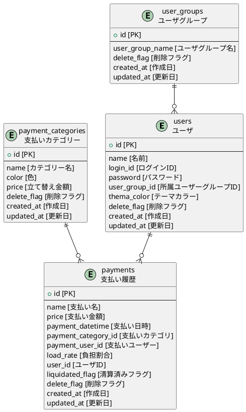

## 家計簿アプリ
### 必要な機能
立て替え額の登録 →　登録画面
立て替え額の確認　→　履歴画面
清算　→　清算画面
ユーザー、購入品カテゴリ、などマスタの登録　→　設定画面

### 機能詳細
清算
グループすべてのユーザが均等に負担する

### 構成技術
フロント　React ts
アプリ化　PWA
バックエンド　nestjs + Prisma + fastly
DB　postgres

### DB構成

